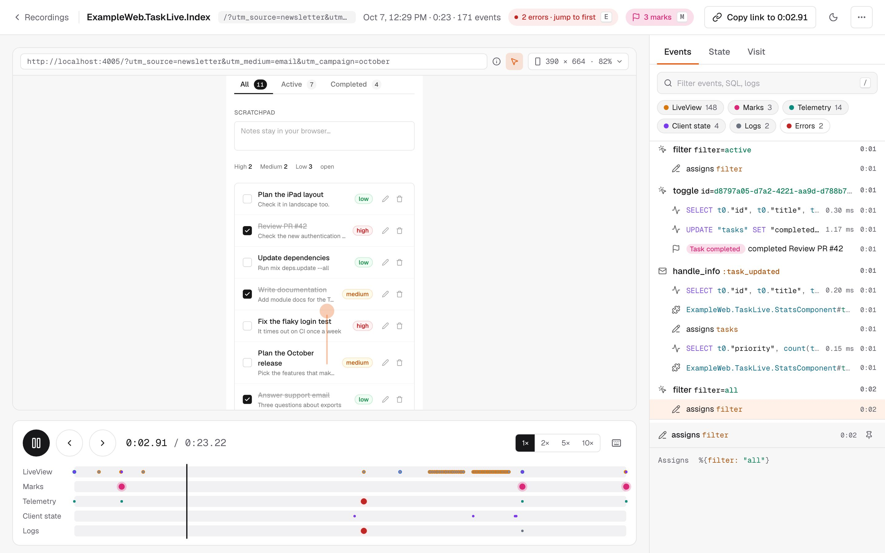

# PhoenixReplay

Session recording and replay for Phoenix LiveView.



LiveView templates are pure functions: same assigns produce the same HTML. PhoenixReplay captures assigns at each state transition and replays them by re-rendering the original view — no client-side recording, no DOM snapshots, no JavaScript changes. A 30-second session with active form input is ~400 events and a few kilobytes on disk.

## Quick start

Add the dependency:

```elixir
def deps do
  [{:phoenix_replay, "~> 0.3.0"}]
end
```

Attach the recorder to a live session:

```elixir
live_session :default, on_mount: [PhoenixReplay.Recorder] do
  live "/dashboard", DashboardLive
  live "/posts", PostLive.Index
end
```

Mount the dashboard behind your admin pipeline:

```elixir
import PhoenixReplay.Router

scope "/admin" do
  pipe_through [:browser, :require_admin]

  phoenix_replay "/replay",
    on_mount: [{MyAppWeb.UserAuth, :ensure_admin}],
    authorize: MyApp.ReplayAuthorization
end
```

Add `:phoenix_replay` to `import_deps` in `.formatter.exs` so the macro keeps its parentheses-free form.

Visit `/admin/replay` to browse recordings and replay them with a scrubber, keyboard controls, and playback speeds. Every connected LiveView in the live session is recorded. Sessions without user interaction are discarded.

## How it works

1. `PhoenixReplay.Recorder` starts recording on the connected mount and attaches lifecycle hooks. Its state lives in `socket.private`, so your assigns are untouched.
2. The LiveView process writes each event straight into an ETS buffer owned by the application, with no message passing on the hot path.
3. `PhoenixReplay.Recorder.Monitor` watches the process. When it exits, the recording is saved in a supervised task with retries, then removed from the buffer. The buffer outlives worker restarts, and the monitor re-attaches to buffered sessions when it starts.
4. Replay re-renders your view's own template with the recorded assigns inside an iframe. Each player drives its frame over a private channel, so viewers never interfere with each other.

### Recorded events

| Event | Data |
|---|---|
| `:mount` | Assigns when recording started |
| `:params` | `handle_params/3` params and URI |
| `:event` | `handle_event/3` name and params |
| `:info` | `handle_info/2` message tag only, never message contents |
| `:render` | Assigns changed by the render |

Each event carries a millisecond offset from the start of the session.

### Current limitations

Replay reconstructs root LiveView assigns. It does not fully reconstruct LiveComponents, streams, uploads, client-only JavaScript state, or pushed JS events. Templates that fail to render with the recorded assigns show a placeholder at that position.

## Dashboard

### Authorization

Recordings can contain business data even after sanitization. Always mount the dashboard behind authentication, and use `PhoenixReplay.Authorization` for per-recording rules:

```elixir
defmodule MyApp.ReplayAuthorization do
  @behaviour PhoenixReplay.Authorization

  @impl true
  def authorize(:clear, _subject, socket), do: socket.assigns.current_user.admin?
  def authorize(_action, _recording, socket), do: socket.assigns.current_user != nil
end
```

Actions are `:list`, `:view`, `:delete` and `:clear`. Recordings a viewer may not see respond with 404.

### Frame layout

The replay frame renders your views, so it needs your stylesheet. By default it loads `/assets/css/app.css` through your endpoint's `static_path/1`. If your assets are content-hashed by a bundler such as Volt, render the frame in your own root layout instead:

```elixir
phoenix_replay "/replay", frame_layout: {MyAppWeb.Layouts, :root}
```

### Assets

The dashboard ships its own small script and stylesheet and loads your application's own Phoenix and LiveView clients, so the client always matches your server version. It needs nothing from your asset pipeline. If your LiveView socket is not mounted at `/live`, pass `live_socket_path: "/socket/live"`.

## Configuration

```elixir
config :phoenix_replay,
  storage: {PhoenixReplay.Storage.File, path: "priv/replay_recordings"},
  sanitizer: PhoenixReplay.Sanitizer.Default,
  max_events: 10_000,
  sample_rate: 1.0,
  retention: [max_age: :timer.hours(24 * 7), max_count: 1_000, interval: :timer.minutes(10)],
  persist: [attempts: 3, backoff: 1_000]
```

All keys are optional and validated at startup; see `PhoenixReplay.Config`.

### Per-session options and sampling

`:sample_rate`, `:max_events` and `:sanitizer` can also be set per live session, overriding the global values:

```elixir
live_session :checkout,
  on_mount: [{PhoenixReplay.Recorder, sample_rate: 0.1, max_events: 2_000}] do
  live "/checkout", CheckoutLive
end
```

With `sample_rate: 0.1`, about one in ten connected sessions is recorded.

### Storage backends

**File (default)** stores each recording as a compressed Erlang term, plus a small summary file so listing never decodes recordings:

```elixir
config :phoenix_replay, storage: {PhoenixReplay.Storage.File, path: "/var/lib/my_app/replays"}
```

**Ecto** stores recordings in a table:

```elixir
config :phoenix_replay, storage: {PhoenixReplay.Storage.Ecto, repo: MyApp.Repo}
```

See `PhoenixReplay.Storage.Ecto` for the migration. Implement `PhoenixReplay.Storage` for any other backend.

### Sanitizer

`PhoenixReplay.Sanitizer.Default` replaces the values of keys containing `password`, `token`, `secret`, `api_key`, `private_key` or `credential` with `"[FILTERED]"`, recursing through maps, lists, tuples and structs, and compacts changesets and forms. To customize, implement `PhoenixReplay.Sanitizer` and delegate what you keep:

```elixir
defmodule MyApp.ReplaySanitizer do
  @behaviour PhoenixReplay.Sanitizer

  @impl true
  def sanitize_assigns(assigns) do
    assigns
    |> Map.drop([:current_user])
    |> PhoenixReplay.Sanitizer.Default.sanitize_assigns()
  end

  @impl true
  defdelegate sanitize_params(params), to: PhoenixReplay.Sanitizer.Default
end
```

### Telemetry

`PhoenixReplay.Telemetry` documents the `[:phoenix_replay, :recording, :persisted | :discarded | :failed]` events.

## Programmatic access

```elixir
config = PhoenixReplay.Config.load()

PhoenixReplay.Recordings.list(config)
PhoenixReplay.Recordings.fetch(config, id)
PhoenixReplay.Recordings.delete(config, id)
PhoenixReplay.Recordings.clear(config)
```

## Development

```sh
mix deps.get
npm ci
npx playwright install chromium
mix ci
```

The dashboard's TypeScript and CSS live in `priv/ts` and `priv/css`, linted and type-checked by `mix volt.js.check`. Their `*.test.ts` files run under `mix test` through Volt's test runner: pure modules in QuickBEAM, LiveView hooks in Chromium. Rebuild the committed bundle with `mix assets.build`; `mix ci` fails when it is stale.

## Roadmap

- LiveComponent state tracking
- Session search and filtering

## Part of Elixir Vibe

PhoenixReplay records LiveView sessions as assigns timelines, making every session replayable and every bug reproducible.

It is one building block of a larger stack — tools that make AI-generated
software checkable: structural search, dependence analysis, duplication and
slop detection, session replay, and ecosystem-wide code search. See the
[Elixir Vibe](https://github.com/elixir-vibe) organization for the rest, and
[Building Blocks for the Future Web](https://github.com/elixir-vibe/building-blocks)
for the thesis, architecture, and roadmap that tie them together.

## License

MIT
